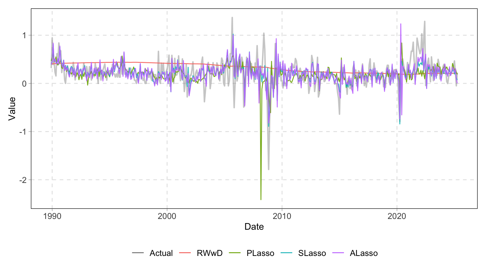
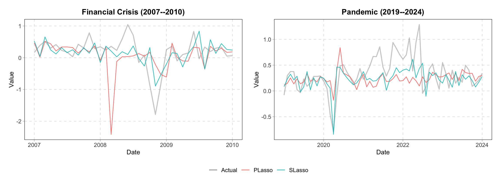
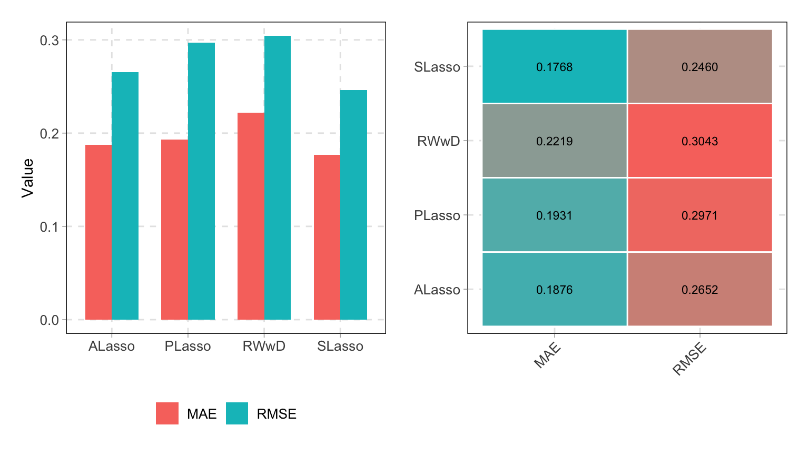
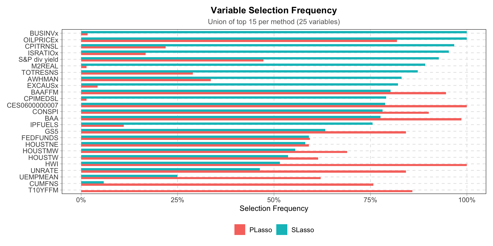
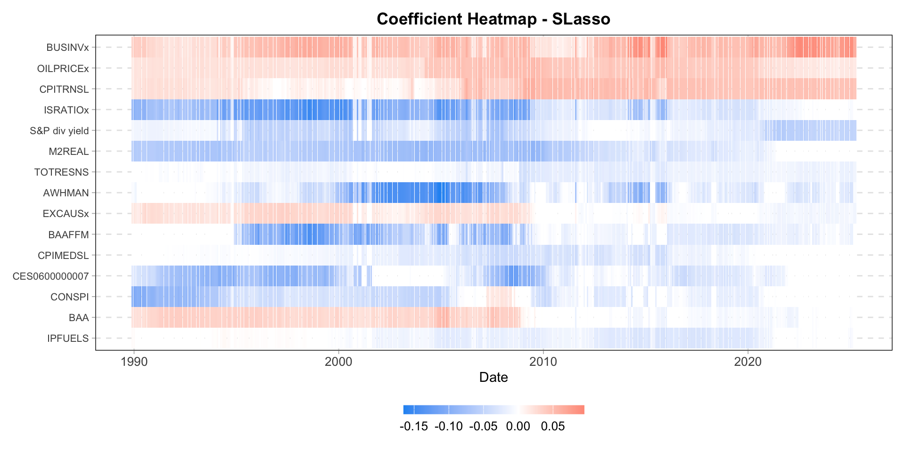
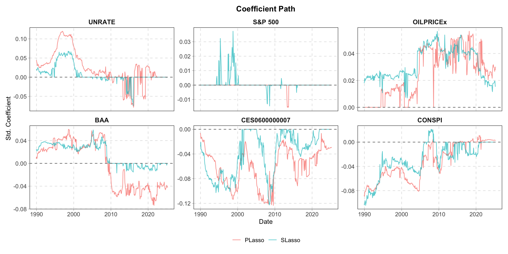
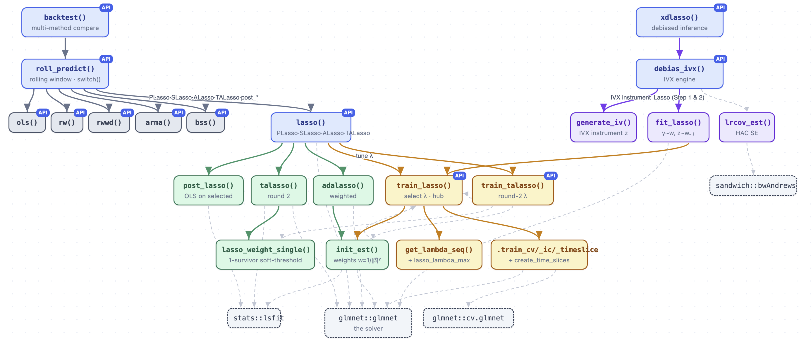

# LasForecast 

<!-- badges: start -->
<!-- [](https://github.com/zhan-gao/LasForecast/actions/workflows/R-CMD-check.yaml) -->
<!-- badges: end -->


`LasForecast` provides a unified framework for economic forecasting using penalized linear predictive regression. The package implements LASSO-family estimators specifically designed for predictive regression with potentially persistent regressors, a setting common in macroeconomics and finance. It automates the following steps: **parameter tuning**, **model estimation**, **rolling/expanding window backtesting**, and **visualization**.

The package primarily implements the methods from three papers:

- Lee, Shi, and Gao (2022) "On LASSO for Predictive Regression", *Journal of Econometrics*, 229(2), 322--349.
- Mei and Shi (2024) "On LASSO for High Dimensional Predictive Regression", *Journal of Econometrics*, 242(2), 105809.
- Gao, Lee, Mei, and Shi (2026) "LASSO Inference for High Dimensional Predictive Regressions", *Journal of Econometrics*, 255, 106240.

## Installation

You can install the development version of LasForecast from [GitHub](https://github.com/) with:

``` r
# install.packages("devtools")
devtools::install_github("zhan-gao/LasForecast")
```

``` r
library(LasForecast)
#>
#>  ╦  ╔═╗╔═╗╔═╗╔═╗╦═╗╔═╗╔═╗╔═╗╔═╗╔╦╗
#>  ║  ╠═╣╚═╗╠╣ ║ ║╠╦╝║╣ ║  ╠═╣╚═╗ ║
#>  ╩═╝╩ ╩╚═╝╚  ╚═╝╩╚═╚═╝╚═╝╩ ╩╚═╝ ╩
#>
#>   Lasso for Predictive Regression
#>   version 1.0.0
```

## Usage

### Data

``` r
library(LasForecast)
data("fredmd")
head(fredmd[, 1:6])
```

```r
#> # A tibble: 6 × 6
#>   date       infl_cpi UNRATE     RPI  W875RX1 DPCERA3M086SBEA
#>   <date>        <dbl>  <dbl>   <dbl>    <dbl>           <dbl>
#> 1 1959-12-01    0.204    5.3 0.0102  0.0114          -0.00114
#> 2 1960-01-01   -0.136    5.2 0.00323 0.00466          0.00279
#> 3 1960-02-01    0.136    4.8 0.00115 0.000906         0.00436
#> 4 1960-03-01    0        5.4 0.00188 0.000905         0.0141 
#> 5 1960-04-01    0.441    5.2 0.00346 0.00361          0.0153 
#> 6 1960-05-01    0.102    5.1 0.00241 0.00243         -0.0204 
```

### Estimation

``` r
# SLasso: standardized LASSO — default and recommended for prediction
mod_s <- lasso(fredmd, y = "infl_cpi", method = "lasso",
               scale_x = TRUE, train_method = "cv")
mod_s$lambda
```
```r
#> [1] 0.01016581
```
```r
# Nonzero coefficients (27 out of 111 predictors selected)
beta <- coef(mod_s)
names(beta) <- c("(Intercept)",
  setdiff(names(fredmd), c("date", "infl_cpi")))
beta[beta != 0]
```
```r
  #> (Intercept)        UNRATE       W875RX1       RETAILx        IPNMAT 
  #> 2.636378919   0.006875706  -2.179056368   0.051365917  -0.602485176 
  #>   UEMP5TO14 CES1021000001      USWTRADE        USGOVT        AWHMAN 
  #> 0.088703136   0.240957606   0.212050873  -1.557810128  -0.066498965 
  #>     HOUSTNE        HOUSTW       AMDMUOx       BUSINVx      ISRATIOx 
  #> -0.007637499   0.061815316   0.924298889  11.683645113  -1.453851798 
  #>      M2REAL      TOTRESNS      BUSLOANS      NONREVSL        CONSPI 
  #> -7.577389816  -0.243363935  -0.354212002  -1.194222671  -0.003027575 
  #>     S&P 500 S&P div yield           GS5      TB3SMFFM      TB6SMFFM 
  #> 0.062277963  -0.111592921   0.144405053  -0.037460812  -0.045439409 
  #>      T5YFFM        AAAFFM       EXSZUSx     OILPRICEx      CPITRNSL 
  #> -0.015522882  -0.013120684  -0.503648093   0.203226880   3.226424574 
  #> CUSR0000SAC   CUSR0000SAD CES2000000008   DTCOLNVHFNM 
  #> 0.205004788   0.895142257   0.133875520   0.021164609
```

``` r
# PLasso
mod_p  <- lasso(fredmd, y = "infl_cpi", method = "lasso", scale_x = FALSE, train_method = "cv")
# Adaptive LASSO
mod_a  <- lasso(fredmd, y = "infl_cpi", method = "alasso", train_method = "cv")
# Twin Adaptive LASSO
mod_ta <- lasso(fredmd, y = "infl_cpi", method = "talasso", train_method = "cv")
# Post-Lasso OLS
mod_po <- lasso(fredmd, y = "infl_cpi", method = "post_alasso", train_method = "cv")
```

``` r
# XDLasso: IVX-desparsified LASSO for valid inference on focal predictors
fit_xd <- xdlasso(fredmd, y = "infl_cpi",
                   d = c("UNRATE", "S&P 500"),
                   train_method = "cv", joint_test = TRUE)
summary(fit_xd)
```
```r
#> IVX-Desparsified Lasso Inference
#> ---
#> Focal coefficients:
#>          Estimate Std. Error t value Pr(>|t|)
#> UNRATE  -0.024175   0.077511 -0.3119   0.7551
#> S&P 500  0.862780   0.545517  1.5816   0.1137
#> 
#> Wald test: chi2(2) = 1.985, p = 0.3707
```

### Backtesting

``` r
# Rolling-window out-of-sample comparison (window = 360 months)
bt_results <- backtest(
  x = fredmd, y = "infl_cpi",
  methods = c("PLasso", "SLasso"),
  roll_window = 360, h = 1,
  loss = c("rmse", "mae"),
  benchmark = "RWwD",
  verbose = FALSE, train_method = "cv"
)
summary(bt_results)
```
```r
#> Method      RMSE       MAE RMSE_Ratio MAE_Ratio
#> 1   RWwD 0.3042642 0.2218854  1.0000000 1.0000000
#> 2 PLasso 0.2970539 0.1930847  0.9763027 0.8702000
#> 3 SLasso 0.2460384 0.1767522  0.8086342 0.7965924
#> 4 ALasso 0.2651720 0.1875667  0.8715189 0.8453314
```

### Visualization

``` r
autoplot(bt_results, type = "forecasts")
```



``` r
# Zoom into the financial crisis and pandemic episodes
library(patchwork)
p_crisis <- autoplot(bt_results, type = "forecasts",
  methods_to_plot = c("PLasso", "SLasso"),
  date_range = c("2007-01-01", "2010-01-01")) +
  ggtitle("Financial Crisis (2007--2010)")
p_pandemic <- autoplot(bt_results, type = "forecasts",
  methods_to_plot = c("PLasso", "SLasso"),
  date_range = c("2019-01-01", "2024-01-01")) +
  ggtitle("Pandemic (2019--2024)")
p_crisis + p_pandemic +
  plot_layout(guides = "collect") &
  theme(legend.position = "bottom")
```



``` r
# Loss metrics: bar chart + heatmap
autoplot(bt_results, type = "bar") + autoplot(bt_results, type = "heatmap")
```



``` r
# Variable selection frequency across rolling windows
autoplot(bt_results, type = "frequency",
         methods = c("SLasso", "PLasso"), top_n = 15)
```



``` r
# Time-varying coefficient heatmap (standardized)
autoplot(bt_results, type = "coef_heatmap", methods = "SLasso", top_n = 15)
```



``` r
# Coefficient paths over time, faceted by method
autoplot(bt_results, type = "coef_path",
  methods = c("PLasso", "SLasso"),
  variables = c("UNRATE", "S&P 500", "OILPRICEx", "BAA", "CES0600000007", "CONSPI"))
```




## Method Summary and Guidelines

The table below summarizes the properties of the five LASSO estimators across key dimensions.

|  | PLasso | SLasso | ALasso | TALasso | XDLasso |
|---|:---:|:---:|:---:|:---:|:---:|
| Dimension | High | High | High | Low | High |
| Mixed roots | No  | I(0) + I(1) | I(0) + I(1)| I(0) + I(1) + cointegration | I(0) + I(1) |
| Variable selection | No | Partial | Yes | Yes | N/A |
| Valid inference | N/A | N/A | N/A | N/A | Yes |


Several practical guidelines emerge:

(i) For *prediction* with a large number of mixed-root predictors, SLasso is the recommended estimator, as it maintains consistency across regressor types and is computationally efficient.

(ii) For *inference* on individual coefficients in high-dimensional predictive regressions, XDLasso delivers valid $t$-tests and Wald tests regardless of regressor persistence, provided the model is sparse.

(iii) For *variable selection* with mixed $I(0)$ and $I(1)$ regressors, ALasso achieves oracle consistency. When cointegration among unit root regressors is potentially present, TALasso restores oracle consistency in the low-dimensional setting ($p$ fixed). Variable selection under mixed roots with cointegration in high dimensions ($p > n$) remains an open problem.


## Unpack `LasForecast`

