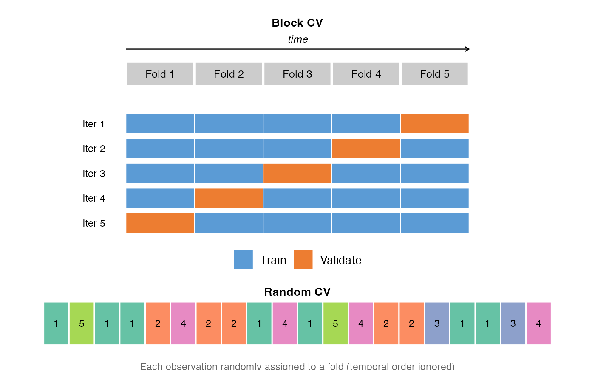
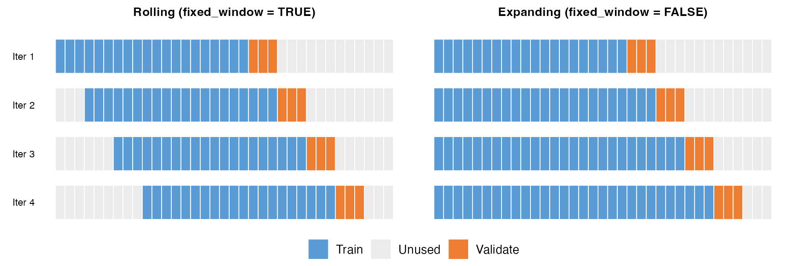
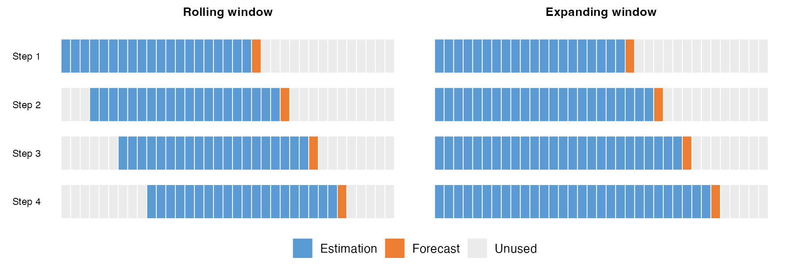

```{r setup, message=FALSE, echo = FALSE}
library(LasForecast)
library(ggplot2)
```

## Introduction

`LasForecast` provides a unified framework for economic forecasting using penalized linear predictive regression. The package implements LASSO-family estimators specifically designed for predictive regression with potentially persistent regressors, a setting common in macroeconomics and finance. It automates the following steps: **parameter tuning**, **model estimation**, **rolling/expanding window backtesting**, and **visualization**.

The package primarily implements the methods from three papers:

- @LSG2022 "On LASSO for Predictive Regression", *Journal of Econometrics*, 229(2), 322--349.
- @MS2024 "On LASSO for High Dimensional Predictive Regression", *Journal of Econometrics*, 242(2), 105809.
- @GLMS2026 "LASSO Inference for High Dimensional Predictive Regressions", *Journal of Econometrics*, 255, 106240.

### Model

Consider the canonical linear predictive regression
$$
y_t = \alpha^* + W_{t-1}^\top \theta^* + u_t, \quad t = 1, \ldots, n,
$$ {#eq-model}
where $y_t$ is the target variable (e.g., stock excess return or inflation), $W_t = (X_t^\top, Z_t^\top)^\top$ is a $p$-dimensional vector of predictors observed at time $t$, $\theta^* = (\beta^{*\top}, \gamma^{*\top})^\top \in \mathbb{R}^p$ is the true coefficient vector, and $u_t$ is the prediction error. The intercept $\alpha^*$ is unpenalized in all LASSO formulations below.

The defining feature of predictive regressions is that the regressors $W_t$ carry heterogeneous degrees of persistence. We distinguish two types:

*Stationary regressors.*
The $p_z \times 1$ vector $Z_t = (z_{1,t}, \ldots, z_{p_z,t})^\top$ collects short-memory, $I(0)$ predictors. In financial applications, these include variables such as stock variance, inflation, and net equity expansion.

*Unit root regressors.*
The $p_x \times 1$ vector $X_t = (x_{1,t}, \ldots, x_{p_x,t})^\top$ collects persistent predictors, each following a unit root process
$$
x_{j,t} = x_{j,t-1} + e_{j,t}, \quad j = 1, \ldots, p_x,
$$ {#eq-unitroot}
where $e_{j,t}$ is the innovation. Common persistent predictors include the dividend-price ratio, earnings-price ratio, and bond term spread. This pure unit root specification is the baseline model studied by @LSG2022 and @MS2024.

*The challenge of mixed roots.*
The coexistence of stationary and persistent regressors creates fundamental difficulties for penalized estimation:

(i) *Different convergence rates.* OLS estimators of coefficients on stationary regressors converge at the $\sqrt{n}$ rate, whereas those on unit root regressors converge at the $n$ rate. A uniform penalty cannot simultaneously accommodate both rates.

(ii) *Stambaugh bias.* The correlation between the regressor innovation $e_t$ and the prediction error $u_t$ introduces an endogeneity bias in finite samples that grows with persistence [@Stambaugh1999].

In practice, the econometrician typically does not know which regressors are stationary and which are persistent; nor is the cointegration structure known. Writing $p = p_x + p_z$ for the total number of regressors, we consider two asymptotic frameworks:

- *Low-dimensional:* $p$ is fixed and $n \to \infty$ [@LSG2022].
- *High-dimensional:* $p = p(n) \to \infty$, possibly $p > n$, while the true model is sparse with $s = |\{j : \theta_j^* \neq 0\}|$ nonzero coefficients [@MS2024; @GLMS2026].

Throughout, the innovations $(e_t, u_t)$ are allowed to be correlated contemporaneously.


### LASSO Variants

Let $W = (W_0, W_1, \ldots, W_{n-1})^\top$ denote the $n \times p$ predictor matrix and $y = (y_1, \ldots, y_n)^\top$ the response vector. For notational economy, the intercept $\alpha^*$ is absorbed through demeaning.

**Plain LASSO (PLasso).** The original @Tibshirani1996 estimator solves
$$
\hat\theta^P = \operatorname*{argmin}_{\theta} \left\{
  \frac{1}{n} \|y - W\theta\|_2^2 + \lambda \|\theta\|_1
\right\},
$$ {#eq-plasso}
where $\lambda > 0$ is a tuning parameter and $\|\theta\|_1 = \sum_{j=1}^p |\theta_j|$. PLasso applies a uniform penalty to all coefficients regardless of the scale or persistence of the corresponding regressor. Consequently, it is *not* scale-invariant. In the presence of mixed roots, persistent regressors have column norms $\|w_j\|_2 = O_p(n)$ while stationary regressors have $\|w_j\|_2 = O_p(\sqrt{n})$, so a uniform penalty under-shrinks the former and over-shrinks the latter.

**Standardized LASSO (SLasso).** To address scale dependence, a widely adopted practice, and the default in the R package `glmnet`, is to standardize each regressor by its sample standard deviation. Define $\hat\sigma_j = \sqrt{n^{-1} \sum_{t=1}^n (w_{j,t-1} - \bar w_j)^2}$ and the diagonal matrix $D = \text{diag}(\hat\sigma_1, \ldots, \hat\sigma_p)$. The SLasso estimator is
$$
\hat\theta^S = \operatorname*{argmin}_{\theta} \left\{
  \frac{1}{n} \|y - W\theta\|_2^2 + \lambda \|D\theta\|_1
\right\}.
$$ {#eq-slasso}
Since $\hat\sigma_j$ absorbs the regressor's marginal variation, the effective penalty $\lambda \hat\sigma_j |\theta_j|$ on each coefficient is commensurate across regressor types. @MS2024 show that this scale-invariance property is crucial: it aligns the magnitudes of persistent and stationary components, maintaining LASSO's *estimation* consistency under mixed roots.

**Adaptive LASSO (ALasso).** The Adaptive LASSO of @Zou2006 introduces data-driven penalty weights to achieve the oracle property. For the predictive regression in @eq-model, it solves (note: the $1/n$ factor used in PLasso/SLasso is absorbed into $\lambda_n$ here)
$$
\hat\theta^A = \operatorname*{argmin}_{\theta} \left\{
  \|y - W\theta\|_2^2 + \lambda_n \sum_{j=1}^p \hat\tau_j |\theta_j|
\right\},
$$ {#eq-alasso}
where $\hat\tau_j = |\hat\theta_j^{\mathrm{init}}|^{-\gamma}$ for some initial consistent estimator $\hat\theta^{\mathrm{init}}$ (typically OLS when $p < n$ and Lasso when $p > n$), and $\gamma > 0$ controls the aggressiveness of the penalty. When $\hat\theta_j^{\mathrm{init}}$ is close to zero (an inactive predictor), the weight $\hat\tau_j$ is large and the penalty effectively forces $\hat\theta_j^A$ to zero. Conversely, when $\hat\theta_j^{\mathrm{init}}$ is far from zero (an active predictor), the penalty is small and the estimate approaches the OLS value.

@LSG2022 show that ALasso attains the oracle asymptotic distribution for the active set in predictive regressions with mixed-persistence regressors. However, in the presence of cointegrated unit root regressors, ALasso only *partially* succeeds:

- When $p < n$, ALasso can use OLS as a consistent initial estimator. While it preserves the cointegration rank, it may fail to exclude all inactive cointegrating variables, potentially leading to over-selection. This limitation motivates the development of TALasso (see @eq-talasso).
- When $p > n$, no consistent initial estimator is available if cointegration is present, as of the development of this package. @MS2024 show that SLasso tends to over-penalize coefficients of cointegrated predictors in this setting. Without a consistent initial estimator, both ALasso and TALasso fail to work in high dimension.

**Twin Adaptive LASSO (TALasso).** @LSG2022 propose the Twin Adaptive LASSO, which applies ALasso twice to handle cointegration. In the first round, ALasso is run as in @eq-alasso to obtain the estimated active set $\hat M^A = \{j : \hat\theta_j^A \neq 0\}$. In the second round, post-selection OLS is performed on $\hat M^A$ to obtain refined estimates $\hat\theta_j^{\mathrm{po}}$, which serve as new penalty weights $\hat\tau_j^{\mathrm{po}} = |\hat\theta_j^{\mathrm{po}}|^{-\gamma}$. The TALasso estimator is
$$
\hat\theta_{\hat M^A}^{TA} = \operatorname*{argmin}_{\theta} \left\{
  \bigg\|y - \sum_{j \in \hat M^A} w_j \theta_j \bigg\|_2^2
  + \lambda_n \sum_{j \in \hat M^A} \hat\tau_j^{\mathrm{po}} |\theta_j|
\right\},
$$ {#eq-talasso}
with $\hat\theta_j^{TA} = 0$ for $j \notin \hat M^A$. The key insight is that, after the first-round ALasso selects $\hat M^A$, the over-selected cointegrating variables lose their cointegrating ties in the post-selection regression. Their post-selection OLS estimates converge at the $n$ rate, producing penalty weights of order $n^{\gamma}$, heavy enough to eliminate them. TALasso is the first estimator to achieve the oracle property in predictive regressions *without* prior knowledge of which regressors are stationary, persistent, or cointegrated. 

**IVX-Desparsified LASSO (XDLasso).** The XDLasso of @GLMS2026 is designed for *inference* rather than prediction or variable selection. It combines three ingredients: the SLasso estimator, the IVX instrument of @PhillipsMagdalinos2009, and the desparsification idea of @ZhangZhang2014. The procedure targets a specific coefficient $\theta_j^*$:

1. Obtain the SLasso estimator $\hat\theta^S$ from @eq-slasso and save the residual $\hat u_t = y_t - W_{t-1}^\top \hat\theta^S$.
2. Construct the IVX instrument $\zeta_{j,t} = \sum_{s=1}^t \rho_\zeta^{t-s} \Delta w_{j,s}$, where $\rho_\zeta = 1 - C_\zeta / n^\tau$ for a user-chosen $\tau \in (0,1)$, and standardize it as $\tilde\zeta_{j,t} = \zeta_{j,t} / \hat\gamma_j$ with $\hat\gamma_j$ the sample standard deviation of $\zeta_{j,t}$.
3. Run an auxiliary LASSO regression of $\tilde\zeta_{j,t-1}$ on $W_{-j,t-1}$ (all regressors except $w_j$) to obtain the residual score vector $\hat r_{j,t} = \tilde\zeta_{j,t} - W_{-j,t}^\top \hat\varphi^{(j)}$.
4. Compute the bias-corrected estimator and its standard error (see @eq-xdlasso below).
5. Compute $t_j^{XD} = (\hat\theta_j^{XD} - \theta_{0,j}) / \hat\omega_j^{XD}$ and compare with the standard normal critical value.

The bias-corrected estimator and standard error in Step 4 are
$$
\hat{\theta}_j^{XD} = \hat{\theta}_j^S
+ \frac{\sum_{t=1}^n \hat r_{j,t-1}\, \hat u_t}{\sum_{t=1}^n \hat r_{j,t-1}\, w_{j,t-1}},
\qquad
\hat\omega_j^{XD} = \frac{\hat\sigma_u \sqrt{\sum_{t=1}^n \hat r_{j,t-1}^2}}
  {\big|\sum_{t=1}^n \hat r_{j,t-1}\, w_{j,t-1}\big|},
$$ {#eq-xdlasso}
where $\hat\sigma_u^2 = n^{-1}\sum_{t=1}^n \hat u_t^2$.
<!-- 
The IVX instrument $\zeta_{j,t}$ is *mildly integrated*, less persistent than a local unit root but more persistent than a stationary process. This intermediate persistence breaks the spurious regression problem that plagues the ordinary desparsified LASSO. The standardization and the auxiliary LASSO together produce a score vector $\hat r_{j,t}$ that is asymptotically uncorrelated with all other regressors, enabling valid inference regardless of whether the regressor of interest is stationary or persistent. -->


### Summary and Comparison

The table below summarizes the properties of the five LASSO estimators across key dimensions.

|  | PLasso | SLasso | ALasso | TALasso | XDLasso |
|---|:---:|:---:|:---:|:---:|:---:|
| Dimension | High | High | High | [Low]{style="color: red;"} | High |
| Mixed roots | [No]{style="color: red;"}  | I(0) + I(1) | I(0) + I(1)| I(0) + I(1) + [cointegration]{style="color: green;"} | I(0) + I(1) |
| Variable selection | [No]{style="color: red;"} | [Partial]{style="color: #CC9900;"} | [Yes]{style="color: green;"} | [Yes]{style="color: green;"} | [N/A]{style="color: gray;"} |
| Valid inference | [N/A]{style="color: gray;"} | [N/A]{style="color: gray;"} | [N/A]{style="color: gray;"} | [N/A]{style="color: gray;"} | [Yes]{style="color: green;"} |

: Comparison of LASSO estimators for predictive regressions. {#tbl-comparison}

Several practical guidelines emerge:

(i) For *prediction* with a large number of mixed-root predictors, SLasso is the recommended estimator, as it maintains consistency across regressor types and is computationally efficient.

(ii) For *inference* on individual coefficients in high-dimensional predictive regressions, XDLasso delivers valid $t$-tests and Wald tests regardless of regressor persistence, provided the model is sparse.

(iii) For *variable selection* with mixed $I(0)$ and $I(1)$ regressors, ALasso achieves oracle consistency. When cointegration among unit root regressors is potentially present, TALasso restores oracle consistency in the low-dimensional setting ($p$ fixed). Variable selection under mixed roots with cointegration in high dimensions ($p > n$) remains an open problem.

<!-- In addition to the five penalized estimators, `LasForecast` implements **post-selection OLS** (Post-Lasso) variants of PLasso, SLasso, ALasso, and TALasso. Post-Lasso runs the corresponding LASSO method to select variables, then re-estimates by OLS on the selected set to reduce shrinkage bias. Together with benchmark methods (Random Walk, Random Walk with Drift, OLS), these are available for rolling-window forecasting and backtesting. We demonstrate their usage below. -->


## Real Data Illustration

### Data

The package ships with the FRED-MD dataset, a panel of macroeconomic time series maintained by the Federal Reserve Bank of St. Louis [@McCrackenNg2016]. Two versions are included: `fredmd` (transformed to stationarity following McCracken and Ng) and `fredmd` (untransformed levels). Both contain 785 monthly observations (December 1959 -- April 2025) across 112 series.

```{r data}
data("fredmd")
# fredmd <- fredmd[fredmd$date >= as.Date("1979-12-01") &
#   fredmd$date <= as.Date("2019-12-01"), ]
dim(fredmd)
head(fredmd[, 1:6])
```

The full sample contains `r nrow(fredmd)` monthly observations (December 1959 -- April 2025). The target variable is `infl_cpi` (CPI inflation rate). The remaining 111 columns serve as predictors.

### Estimation

The `lasso()` function is the unified interface for fitting all LASSO variants. It accepts flexible inputs: when `x` is a data frame, the function auto-detects and removes the date column, and when `y` is specified as a column name string, it extracts `y` from `x` and uses all remaining columns as predictors. Internally, `lasso()` calls `prepare_input()` for input processing, `train_lasso()` for tuning parameter selection, and the appropriate estimation routine.

#### PLasso, SLasso, ALasso, TALasso

We use SLasso as a running example to illustrate the estimation workflow. We hold out the final 12 months so that the forecasts at the end of this subsection are genuinely out-of-sample. SLasso is fit via `method = "lasso"` with `scale_x = TRUE` (the default):

```{r slasso-fit, cache=TRUE}
# Hold out the last 12 months: mod_s never sees them during fitting, so the
# forecasts below are genuinely out-of-sample rather than in-sample fits.
mod_s <- lasso(fredmd[1:(nrow(fredmd) - 12), ],
  y = "infl_cpi", method = "lasso",
  scale_x = TRUE, train_method = "cv"
)
```

The returned object is of class `lasforecast_model`. Key components include the selected penalty parameter `lambda` and the coefficient vector `coefficients`:

```{r slasso-inspect}
mod_s$lambda
mod_s$method
```

The `coef()` method returns the full coefficient vector (intercept first, then slopes). Nonzero entries correspond to selected predictors:

```{r slasso-coef}
beta <- coef(mod_s)
names(beta) <- c(
  "(Intercept)",
  setdiff(names(fredmd), c("date", "infl_cpi"))
)
beta[beta != 0]
```

**Time alignment.** The predictive regression model @eq-model pairs $y_t$ with $W_{t-1}$, so the response is one period ahead of the predictors. Both `lasso()` and `xdlasso()` handle this alignment automatically via the `predictive` argument. When the input is a data.frame with a detected date column (as with `fredmd`), `predictive` defaults to `TRUE` and the function internally shifts the data so that $y_t$ is regressed on $x_{t-1}$, dropping one observation. When the input is a raw matrix (no date information), `predictive` defaults to `FALSE`, assuming the user has pre-aligned the data. The user can always override with an explicit `predictive = TRUE` or `FALSE`.

The `predict()` method computes fitted values for new predictor data via the `newx` argument. Since the model is a predictive regression, to forecast inflation in the held-out last 12 months, we feed predictors from the *preceding* 12 months. Because `mod_s` was fit without these observations, the forecasts are genuinely out-of-sample:

```{r slasso-predict}
n <- nrow(fredmd)
target_rows <- (n - 11):n
pred_rows <- target_rows - 1
x_new <- as.matrix(fredmd[pred_rows, !(names(fredmd) %in% c("date", "infl_cpi"))])
y_hat <- predict(mod_s, newx = x_new)
data.frame(
  date = fredmd$date[target_rows],
  actual = fredmd$infl_cpi[target_rows],
  predicted = y_hat
)
```


**PLasso.** The plain LASSO without standardization. Set `scale_x = FALSE`:

```{r plasso, cache=TRUE}
mod_p <- lasso(fredmd,
  y = "infl_cpi", method = "lasso",
  scale_x = FALSE, train_method = "cv"
)
```

**ALasso.** The Adaptive LASSO uses data-driven penalty weights from an initial estimator. The `model` argument controls the initial estimator: `"ols"` (when $p < n$), `"lasso"`, or `"ridge"`. If `model = NULL` (default), the function auto-selects based on dimensionality.

```{r alasso, cache=TRUE}
mod_a <- lasso(fredmd, y = "infl_cpi", method = "alasso", train_method = "cv")
```

**TALasso.** The Twin Adaptive LASSO runs ALasso twice: the first round selects variables, and the second round refines with updated penalty weights from post-selection OLS. As in @LSG2022, the TALasso is intened to deal with cointegrated regressor in low dimension. A warning will be released if a shrinkage initial estiamtor is invoked.

```{r talasso, cache=TRUE}
mod_ta <- lasso(fredmd, y = "infl_cpi", method = "talasso", train_method = "cv")
```


```{r talasso_low, cache=TRUE}
mod_ta <- lasso(fredmd[, 1:30], y = "infl_cpi", method = "talasso", train_method = "cv")
```


**Post-Lasso OLS.** Each method has a post-selection variant (`"post_lasso"`, `"post_alasso"`, `"post_talasso"`) that uses the corresponding LASSO for variable selection, then re-estimates by OLS on the selected set to reduce shrinkage bias.

```{r post-lasso, cache=TRUE}
mod_post <- lasso(fredmd, y = "infl_cpi", method = "post_alasso", train_method = "cv")
```


#### XDLasso

The methods above (SLasso, PLasso, ALasso, TALasso) produce point estimates and forecasts, but do not deliver valid inference (confidence intervals, $p$-values) for individual coefficients. `xdlasso()` fills this gap by implementing the IVX-desparsified LASSO of @GLMS2026, which provides asymptotically normal $t$-statistics regardless of whether the regressor of interest is stationary or persistent.

We illustrate with a *predictive Phillips curve*: forecasting CPI inflation from the unemployment rate (`UNRATE`) while controlling for 110 other macroeconomic predictors. This is the empirical application studied in @GLMS2026.

Like `lasso()`, `xdlasso()` accepts data.frame, tibble, or tsibble inputs with `y` specified as a column name. The focal predictors for inference are specified by name via the `d` argument (or by column index via `d_ind`).


```{r xdlasso, cache=TRUE}
fit_xd <- xdlasso(fredmd,
  y = "infl_cpi",
  d = c("UNRATE", "S&P 500"),
  train_method = "cv", joint_test = TRUE
)
```

The `summary()` method prints a coefficient table for the focal variables, debiased IVX estimates with standard errors, $t$-values, and $p$-values, then the Wald test (if requested), followed by the Lasso-selected control variables from the first stage.

```{r xdlasso-summary}
summary(fit_xd)
```


#### Tuning Parameter Selection

The penalty parameter $\lambda$ is selected by the `train_method` argument. The package offers three families of tuning methods, each with different assumptions about the data.

**Information criteria** (`"aic"`, `"bic"`, `"aicc"`, `"hqc"`). These fit the model once along the full $\lambda$ path and select the $\lambda$ minimizing the chosen criterion. BIC tends to select sparser models than AIC. These methods are fast and do not require sample splitting. HQC (Hannan--Quinn) lies between AIC and BIC in sparsity.

**Block cross-validation** (`"cv"`, `"cv_random"`). The `"cv"` method splits the sample into $k$ contiguous blocks and uses each block as a validation fold. This preserves the temporal ordering within each block but allows temporal gaps at fold boundaries. The `"cv_random"` method assigns observations to folds randomly, ignoring temporal structure; it is in general inappropriate for dependent data.

{width=85%}

**Time-series cross-validation** (`"timeslice"`). This method respects the temporal ordering strictly: training always uses past data and validation uses future data. Key parameters:

- `initial_window`: size of the first training set (default: 70% of $n$)
- `horizon`: number of periods in each validation set (default: 1)
- `fixed_window`: if `TRUE` (default), training window rolls forward at fixed size; if `FALSE`, it expands
- `skip`: number of periods to skip between successive splits (default: 0)

{width=100%}

```{r timeslice, cache=TRUE}
mod_ts <- lasso(fredmd,
  y = "infl_cpi", method = "lasso",
  train_method = "timeslice",
  initial_window = 240, horizon = 1, fixed_window = TRUE, skip = 0
)
print(c(mod_ts$lambda, mod_s$lambda))
```

### Backtesting

The `backtest()` function evaluates and compares forecasting methods by repeatedly estimating models on historical data and scoring their out-of-sample predictions. At each step, the model is trained on the `roll_window` most recent observations and used to generate a one-step-ahead (or $h$-step-ahead) forecast. The window then advances one period and the process repeats, producing a time series of pseudo out-of-sample forecasts for every method specified.

{width=100%}

Within each window, the predictive time alignment $y_t \sim W_{t-1}$ is maintained automatically. The function computes the requested loss metrics (`rmse`, `mae`, `mse`, `mape`, `r2oos`) across all out-of-sample forecasts, and optionally reports them as ratios relative to a benchmark method (default: Random Walk with Drift).

Alongside the penalized estimators, `backtest()` and `roll_predict()` accept the standard benchmarks `"RW"`, `"RWwD"`, `"OLS"`, and `"ARMA"`. The `"ARMA"` method is a univariate ARMA model on the target: its order can be fixed via `arma_order = c(p, d, q)`, or left unspecified, in which case the AR and MA orders are selected automatically by information criterion within each window.

```{r backtest, cache = TRUE}
bt_results <- backtest(
  x = fredmd,
  y = "infl_cpi",
  methods = c("PLasso", "SLasso", "ALasso"),
  roll_window = 360,
  h = 1,
  loss = c("rmse", "mae"),
  benchmark = "RWwD",
  verbose = FALSE,
  train_method = "cv"
)
```

```{r summary}
summary(bt_results)
```

### Visualization

The `autoplot()` method for backtest objects supports multiple plot types. 

#### Time Series Plot: Actual v.s. Predicted
The `"forecasts"` type overlays the actual target series (gray) with predictions from each method:

```{r backtest-forecasts, fig.width=8, fig.height=4.5}
autoplot(bt_results, type = "forecasts")
```

Use `methods_to_plot` to select specific methods and `date_range` to zoom into a time window: zooming into two turbulent episodes, the 2007--09 financial crisis and the 2020--21 pandemic, reveals how well the Lasso forecasts track actual inflation during extreme swings:

```{r backtest-zoom, fig.width=12, fig.height=4.5}
library(patchwork)
p_crisis <- autoplot(bt_results,
  type = "forecasts",
  methods_to_plot = c("PLasso", "SLasso"),
  date_range = c("2007-01-01", "2010-01-01")
) + ggtitle("Financial Crisis (2007--2010)")

p_pandemic <- autoplot(bt_results,
  type = "forecasts",
  methods_to_plot = c("PLasso", "SLasso"),
  date_range = c("2019-01-01", "2024-01-01")
) + ggtitle("Pandemic (2019--2024)")

p_crisis + p_pandemic + plot_layout(guides = "collect") &
  theme(legend.position = "bottom")
```


#### Accuracy Metrics

The `"bar"` and `"heatmap"` plot types visualize loss metrics across methods. Set `ratio = TRUE` to show values relative to the benchmark:

```{r backtest-metrics, fig.width=8, fig.height=4.5}
autoplot(bt_results, type = "bar") + autoplot(bt_results, type = "heatmap")
```


#### Variable Selection

Lasso methods perform implicit variable selection at every rolling window. The `"frequency"` type shows how often each predictor is selected (nonzero coefficient) across all windows. The `methods` argument selects which methods to display; variables are sorted by the frequency of the first method listed. The displayed set is the union of each method's top `top_n` variables:

```{r backtest-frequency, fig.width=10, fig.height=5}
autoplot(bt_results, type = "frequency", methods = c("SLasso", "PLasso"), top_n = 15)
```

The `"coef_heatmap"` type reveals the time-varying sparsity pattern, showing which predictors enter or leave the model as the estimation window rolls forward. By default, coefficients are *standardized*: each $\hat\beta_j$ is multiplied by the sample standard deviation $\hat\sigma_j$ of the corresponding predictor, so the color intensity represents the effect per one-standard-deviation change. 

```{r backtest-coef-heatmap, fig.width=10, fig.height=5}
autoplot(bt_results, type = "coef_heatmap", methods = "SLasso", top_n = 15)
```

Instead of relying on `top_n`, you can specify exact variables to display via the `variables` argument. Zooming into the financial crisis and pandemic periods shows how the selected predictors and their magnitudes shift during turbulent episodes:

```{r backtest-coef-heatmap-zoom, fig.width=10, fig.height=5, message=FALSE}
p_crisis <- autoplot(bt_results,
  type = "coef_heatmap", methods = "SLasso",
  variables = c("UNRATE", "OILPRICEx", "BAA", "CES0600000007", "CONSPI"),
  date_range = c("2007-01-01", "2010-01-01")
) + ggtitle("Financial Crisis (2007--2010)")

p_pandemic <- autoplot(bt_results,
  type = "coef_heatmap", methods = "SLasso",
  variables = c("UNRATE", "OILPRICEx", "BAA", "CES0600000007", "CONSPI"),
  date_range = c("2019-01-01", "2024-01-01")
) + ggtitle("Pandemic (2019--2024)")

p_crisis + p_pandemic +
  plot_layout(guides = "collect") &
  scale_fill_gradient2(
    low = "#2196F3", mid = "white", high = "#F44336", midpoint = 0,
    limits = c(-0.15, 0.15), oob = scales::squish, n.breaks = 5,
    guide = guide_colorbar(barwidth = 10, barheight = 0.5)
  ) &
  theme(legend.position = "bottom")
```

The `"coef_path"` type shows each variable's coefficient trajectory over time, faceted so that multiple methods can be compared side by side. Like `"coef_heatmap"`, it supports `standardize`, `date_range`, and `variables`:

```{r backtest-coef-path, fig.width=12, fig.height=6}
autoplot(bt_results,
  type = "coef_path",
  methods = c("PLasso", "SLasso"),
  variables = c("UNRATE", "S&P 500", "OILPRICEx", "BAA", "CES0600000007", "CONSPI")
)
```

## Extending the Framework

The sections above illustrate the estimators shipped with the package. This section changes the perspective: `LasForecast` is designed as an *infrastructure* for predictive regression backtesting. The estimation, rolling-forecast, and visualization layers communicate exclusively through a single lightweight S3 class, `lasforecast_model`. Any estimator of the linear predictive regression @eq-model that returns this class — whatever its internal machinery — plugs into the entire pipeline: rolling and expanding windows, loss metrics and benchmark ratios, and every `autoplot()` type of the previous section. We first document the class and then walk through a concrete extension, best subset selection (BSS), an estimator outside the LASSO family that entered the package in exactly this way.

### The `lasforecast_model` Class

A fitted model is a plain R list carrying the class attribute `"lasforecast_model"`. For instance, the SLasso fit from the estimation section has the structure:

```{r model-str}
str(mod_s, max.level = 1)
```

The contract is deliberately minimal — for forecasting purposes, every linear predictive regression estimator reduces to a coefficient vector and a label:

- `coefficients` (required): numeric vector of estimates, intercept first when the model has one. This is the only component the prediction layer relies on: `predict.lasforecast_model()` computes the linear forecast and infers the presence of an intercept from the vector length.
- `method` (required): character string identifying the estimator, used by `print()` and as the label in summaries and plots.
- `lambda` or `tuning_param` (optional): the selected tuning parameter, recorded window by window in rolling exercises.
- `fit` (optional): arbitrary method-specific detail (for SLasso, the underlying `glmnet` object). Nothing downstream depends on it.

At every window, `roll_predict()` — and therefore `backtest()`, which is built on it — interacts with the fitted object only through this contract: it stores the slope coefficients, the tuning parameter, and the number of nonzero slopes, and it forms the $h$-step-ahead forecast via `predict(model, newx = ...)`. All evaluation and visualization machinery consumes these stored quantities, never the method's internals. Adding a new method to the package therefore takes two steps:

1. Write an estimation function that returns a `lasforecast_model`:

```{r method-skeleton, eval=FALSE}
my_method <- function(x, y, ...) {
  # ... estimation producing alpha_hat, beta_hat, and a tuning value ...
  structure(
    list(
      coefficients = c(alpha_hat, beta_hat), # intercept first
      method = "my_method",
      tuning_param = tuning_value, # optional
      fit = NULL # optional method-specific details
    ),
    class = "lasforecast_model"
  )
}
```

2. Register the method name in `roll_predict()`: one entry in its catalogue of valid methods and one line in its per-window `switch()` dispatch.

The generics `print()`, `coef()`, and `predict()` work for the new method out of the box, and so do the `backtest()` summaries and plots.

### Example: Best Subset Selection

The LASSO penalty $\|\theta\|_1$ is the convex relaxation of the cardinality constraint $\|\theta\|_0 = \sum_{j=1}^p 1\{\theta_j \neq 0\}$. Best subset selection attacks the nonconvex problem directly:
$$
\hat\theta^{BSS} = \operatorname*{argmin}_{\theta}\ \|y - W\theta\|_2^2
\quad \text{subject to} \quad \|\theta\|_0 \le k,
$$ {#eq-bss}
the best-fitting regression with at most $k$ active predictors (the intercept is handled by demeaning and not counted in $k$). @BKM2016 show that modern mixed integer optimization (MIO) solves @eq-bss exactly at practically relevant scales. The package implements their approach in `bss()`: for each candidate subset size, a discrete first-order algorithm supplies a warm start to the Gurobi MIO solver, which returns the exact constrained least squares optimum; the subset size is fixed by the user or selected by information criterion (BIC by default) over a candidate set, by default $k = 0, 1, \ldots, k_{\max}$.

As an estimator, BSS differs from the LASSO family in almost every respect: the optimization is combinatorial rather than convex, the solver is external (Gurobi) rather than `glmnet`, and the tuning parameter is the integer subset size $k$ rather than a continuous penalty level $\lambda$. It is also exactly scale-equivariant: `bss()` solves the problem on the raw data with no standardization at any stage, and rescaling a predictor merely rescales its coefficient inversely, leaving the selected subset and the forecasts unchanged — the PLasso--SLasso distinction is moot for BSS. Unlike the LASSO variants above, BSS has no established asymptotic theory under mixed-persistence regressors; within the package it serves as an agnostic $\ell_0$ benchmark for the LASSO-family methods. These differences make it a natural stress test of the interface. Since Gurobi is commercial software (free academic licenses are available), the `gurobi` R package is declared in `Suggests`, and the two chunks below evaluate only on machines where it is installed.

```{r bss-fit, cache=TRUE, eval=requireNamespace("gurobi", quietly = TRUE)}
mod_bss <- bss(fredmd, y = "infl_cpi", k = 5)
mod_bss
```

Despite the entirely different machinery, the returned object obeys the same contract — `method`, `tuning_param` (the subset size), and an intercept-first `coefficients` vector — so the generic methods apply unchanged:

```{r bss-coef, eval=requireNamespace("gurobi", quietly = TRUE)}
b_bss <- coef(mod_bss)
names(b_bss) <- c("(Intercept)", setdiff(names(fredmd), c("date", "infl_cpi")))
b_bss[b_bss != 0]
```

Here we fix `k = 5` to keep the vignette light; with the default `k = NULL`, `bss()` selects the subset size by information criterion and stores the search path in `fit$ic_path`. `predict()` works exactly as in the SLasso example above.

Step 2 of the recipe is the registration inside `roll_predict()`, which in stylized form reads:

```{r bss-dispatch, eval=FALSE}
switch(method,
  "SLasso" = lasso(x_est, y_est, method = "lasso", scale_x = TRUE, ...),
  # ... other built-in methods ...
  "BSS" = bss(x_est, y_est, k = bss_k, predictive = FALSE, ...)
)
```

Note the explicit `predictive = FALSE`: the rolling loop already pairs $y_t$ with $W_{t-1}$ when forming each window sample, so the per-window call must disable the estimator's own predictive alignment. With this entry, `"BSS"` joins the method set of `roll_predict()` and `backtest()`: its `bss_k` argument fixes the per-window subset size, while the default `bss_k = NULL` re-selects $k$ by information criterion within every window, at the cost of $k_{\max}$ MIO solves per window. All loss summaries, benchmark ratios, and `autoplot()` types of the previous section then apply to BSS automatically. The same two steps — return a `lasforecast_model`, register the name — extend the backtesting infrastructure to any estimator of @eq-model.

## References

